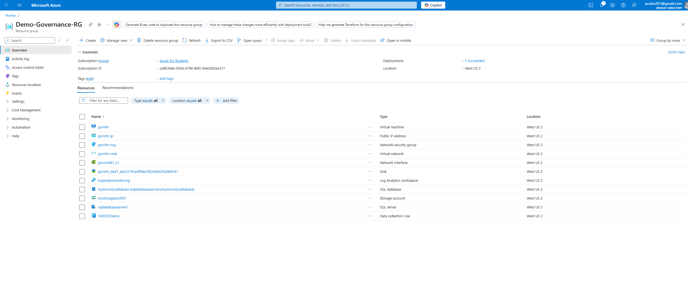
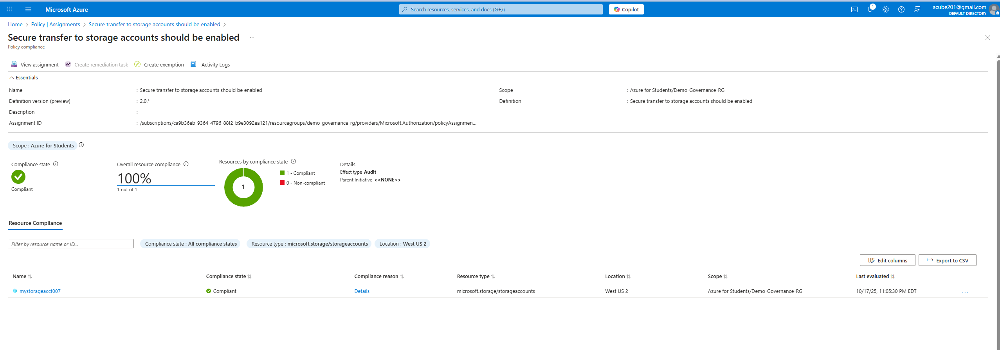
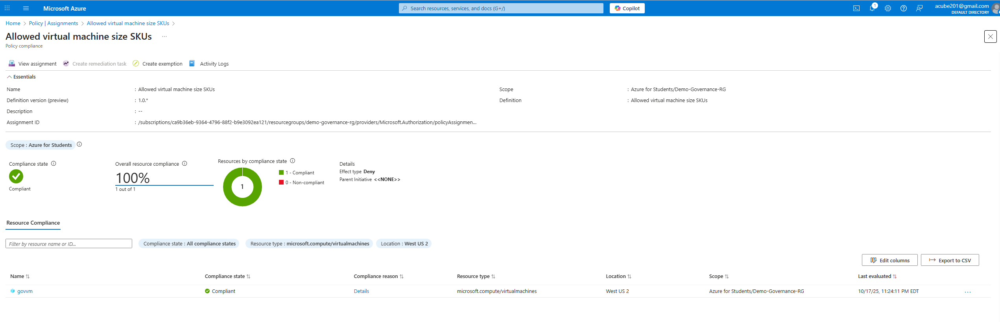
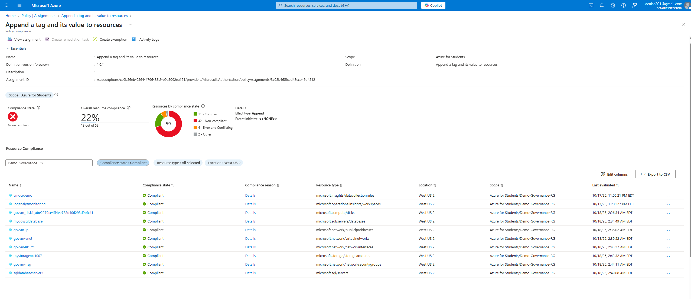
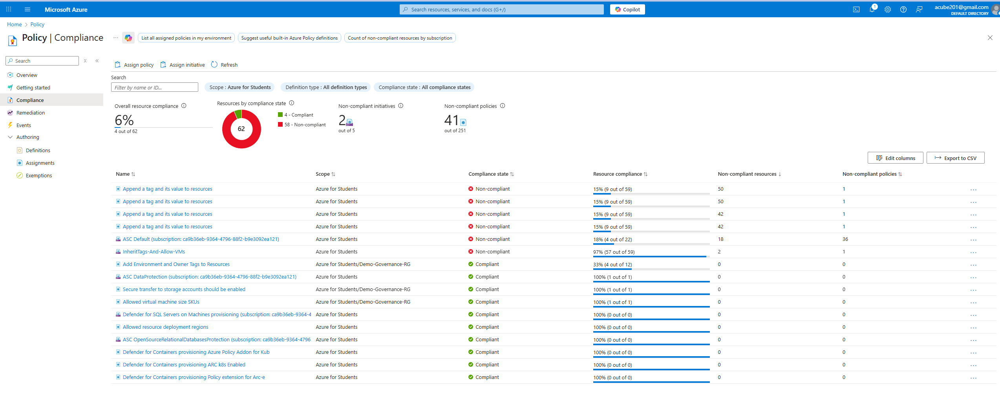
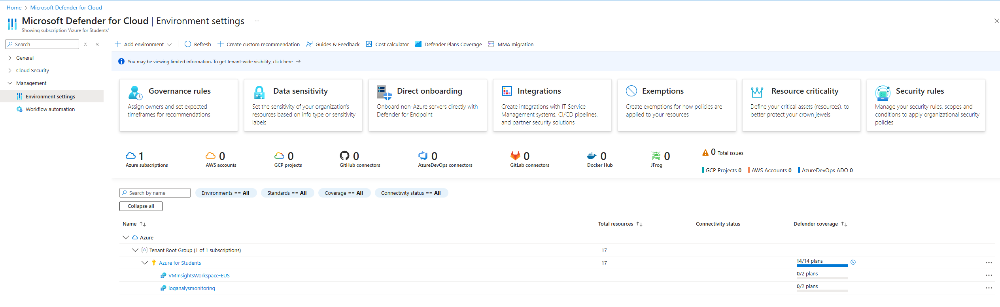
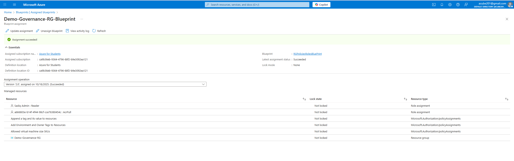
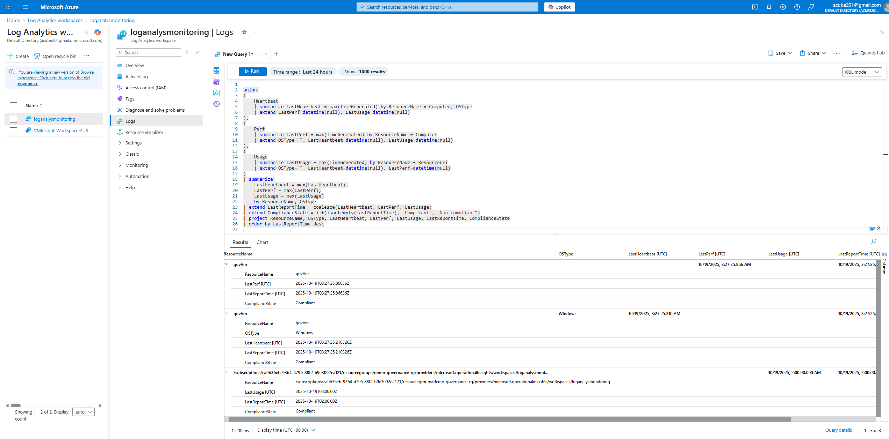

Azure Governance & Compliance Demo
Project Overview

Objective: Demonstrate the ability to enforce enterprise-level cloud governance, compliance, and security in Azure by implementing policies, blueprints, logging, and monitoring.

This project showcases hands-on implementation of Azure best practices for resource compliance, security monitoring, and repeatable governance.

| Resource Type           | Name                  | Purpose                                     |
| ----------------------- | --------------------- | ------------------------------------------- |
| Resource Group          | `Demo-Governance-RG`  | Centralized management for demo resources   |
| Virtual Machine         | `GovVm`               | Sample compute resource                     |
| Storage Account         | `mystorageacct007`    | Sample storage for policy enforcement       |
| SQL Database            | `myGovSQLdatabase`    | Sample database for auditing and monitoring |
| Log Analytics Workspace | `loganalysmonitoring` | Centralized log collection                  |
 

Azure Policies Implemented
| Policy Name                           | Description                                                                   | Scope          | Compliance Status | Screenshot                                     |
| ------------------------------------- | ----------------------------------------------------------------------------- | -------------- | ----------------- | ---------------------------------------------- |
| Secure transfer to storage accounts   | Enforces secure transfer to protect data in transit                           | Resource Group | 100% Compliant    |  |
| Allowed virtual machine size SKUs     | Restricts virtual machines to approved SKUs for cost and compliance control   | Resource Group | 100% Compliant    |             |
| Add Environment and Owner Tags        | Adds Environment and Owner tags to all new resources for governance reporting | Resource Group | 100% Compliant    |         |
| InheritTags-And-Allow-VMs             | Ensures newly created virtual machines automatically inherit required tags    | Resource Group | 100% Compliant    |

 Manual tagging was applied due to subscription limitations preventing automated remediation.

Azure Defender & Security Monitoring

Microsoft Defender for Cloud enabled across the subscription and resource group.

Alerts configured for:

Suspicious login attempts

VM vulnerabilities or high CPU usage

Storage accounts without HTTPS

Centralized visibility achieved via Log Analytics Workspace (loganalysmonitoring).

| Blueprint Artifact      | Purpose                                                                   |
| ----------------------- | ------------------------------------------------------------------------- |
| Resource Group Template | Ensures consistent and repeatable environment creation                    |
| Policies (from Step 3)  | Enforces secure configuration and compliance automatically                |
| Role Assignments        | Applies least privilege roles (Reader/Contributor) for deployment control |

Outcome:
This blueprint enables governed, repeatable deployments aligned with organizational compliance baselines.

Audit Logging & Log Analytics Integration

Configured diagnostic settings for:

Virtual Machine: GovVm

Storage Account: mystorageacct007

SQL Database: myGovSQLdatabase

All activity and security logs are forwarded to Log Analytics Workspace: loganalysmonitoring.

| Challenge                                               | Solution & Outcome                                                                                            
-------------------------------------------------------------------------------------------------------------------------------------------------------------------------------------------------------------------------- |
| Ensuring storage accounts enforce secure transfer       | Implemented the built-in Azure Policy “Require secure transfer” to automatically enforce HTTPS across all storage accounts, ensuring data-in-transit protection and full compliance.                                       |
| Integrating Defender alerts with centralized monitoring | Configured diagnostic settings for VMs, Storage, and SQL Database to forward all security alerts and logs to the Log Analytics workspace (`loganalysmonitoring`), enabling centralized visibility and actionable insights. |
| Blueprint assignment requiring elevated permissions     | Assigned appropriate RBAC roles to the blueprint contributor, enabling successful deployment of policies and resources while maintaining controlled access.                                                                |
| Monitoring SQL Database activity for compliance         | Enabled SQL auditing and forwarded logs to Log Analytics to ensure database activity is tracked, monitored, and compliant with organizational standards.                                                                   |
| Automatic tagging of new resources                      | Implemented an automatic tagging policy for Environment and Owner tags, ensuring consistent metadata for governance and reporting purposes.                                                                                |

Summary & Impact

This project demonstrates the full lifecycle of Azure governance and compliance enforcement, including:

Policy-driven compliance: Enforcing secure configurations and tagging by default.

Security operations integration: Using Defender and Log Analytics for centralized security monitoring.

Blueprint standardization: Deploying compliant environments at scale with automated governance.

Auditing and observability: Leveraging KQL and diagnostic logs for real-time visibility.

Key takeaway:
This project proves the ability to design, implement, and manage enterprise-level cloud governance — aligning security, compliance, and operational excellence.

[resource-overview]: images/resource-overview.png